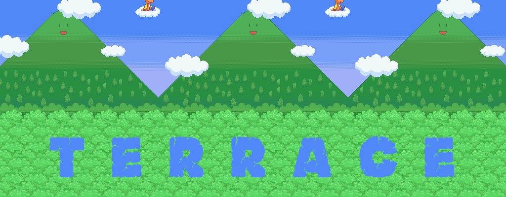
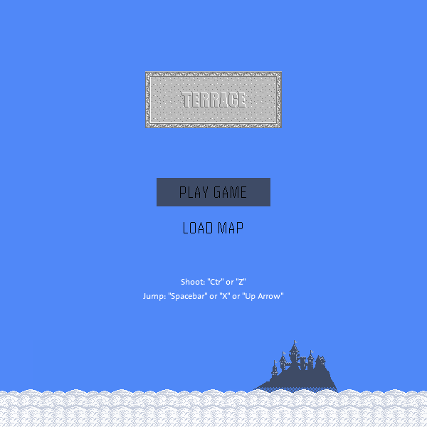
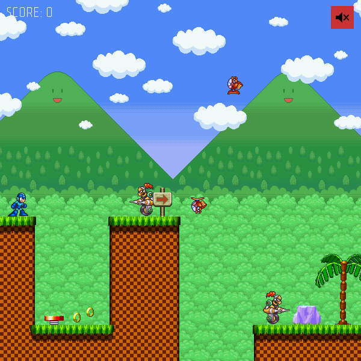

# Terrace

This is a grid-based side-scrolling game built from scratch using the [Processing](https://processing.org/) library.
The sprites derive from some classic NES titles such as Mega Man (Capcom), Mario (Nintendo), and Sonic The Hedgehog (Sega) and I claim no ownership of them.
The game is not meant for commercial use, it is merely a demonstration of my Java abilities.

### Map Editor

This game engine also includes an editor to create and modify map files that can be loaded into the game.
It can be found [here](https://github.com/jabes/terrace-editor).

### Screenshots

